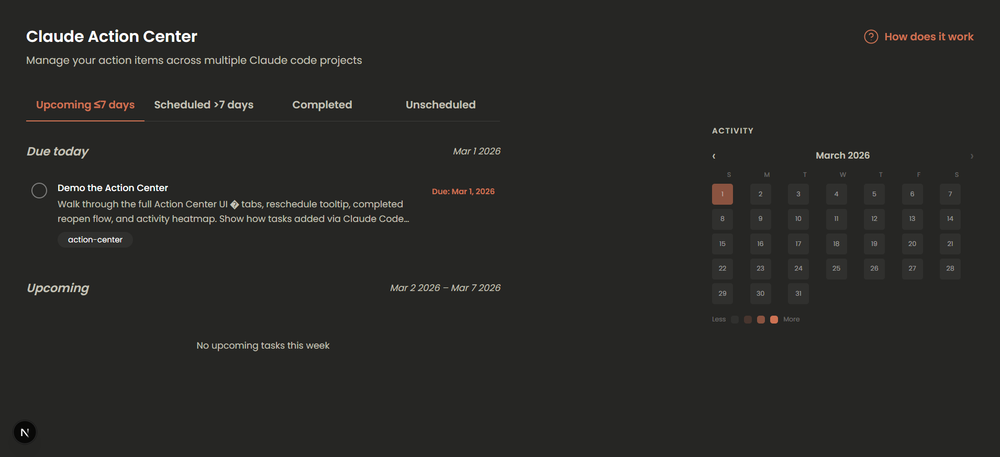

# Claude Action Center

A personal task manager built for Claude power users. Action items captured mid-conversation via an MCP server surface here as a structured, time-based task list.



---

## What it is

The Action Center is a single-page desktop web app paired with an MCP server. While working in Claude Code, you can say "add that to my Action Center" and the task appears instantly in the UI — with a generated title, notes, and due date. The app organises tasks across four tabs: **Upcoming**, **Scheduled**, **Completed**, and **Unscheduled**.

The database is local to your machine and is never committed to the repository. Each person who runs this app has their own private `dev.db`.

---

## Project structure

```
claude-action-center/
├── action-center-app/   # Next.js web app
└── mcp-server/          # MCP server for Claude integration
```

---

## Prerequisites

- [Bun](https://bun.sh) — used for both the web app and MCP server
- [Claude Code](https://claude.ai/code) — to use the MCP integration

---

## Setup: Web app

### 1. Install dependencies

```bash
cd action-center-app
bun install
```

### 2. Create your environment file

Create a `.env` file in the `action-center-app/` root:

```env
DATABASE_URL="file:./dev.db"
```

### 3. Create and migrate the database

This generates your local `dev.db` SQLite file and applies the schema:

```bash
bunx prisma migrate dev --name init
```

### 4. Start the dev server

```bash
bun run dev
```

Open [http://localhost:3000](http://localhost:3000). The app must be running for the MCP server to save tasks.

---

## Setup: MCP server

The MCP server connects Claude to your running Action Center app.

### 1. Install dependencies

```bash
cd mcp-server
bun install
```

### 2. Register the server with Claude Code

Add the following to your Claude MCP config (typically `~/.claude/claude_mcp_config.json`):

```json
{
  "mcpServers": {
    "action-center": {
      "command": "bun",
      "args": ["run", "/absolute/path/to/mcp-server/src/index.ts"],
      "env": {
        "ACTION_CENTER_URL": "http://localhost:3000"
      }
    }
  }
}
```

Replace `/absolute/path/to/mcp-server/` with the actual path on your machine.

### 3. Restart Claude Code

The MCP server connects automatically when Claude Code starts. The web app must be running at `localhost:3000` for tasks to be saved.

---

## Using it

Once both are running, you can talk to Claude naturally:

| What you say | What happens |
|---|---|
| "Add that to my Action Center" | Claude generates a title + notes, asks for a due date, confirms, then saves |
| "What's on my action list?" | Claude lists your open tasks |
| "Mark the Electron task as done" | Claude finds the task by name and marks it complete |

---

## API

The web app exposes a REST API at `http://localhost:3000/api`:

| Method | Endpoint | Description |
|---|---|---|
| `GET` | `/api/tasks` | List all tasks |
| `POST` | `/api/tasks` | Create a task |
| `PATCH` | `/api/tasks/:id` | Update a task |
| `GET` | `/api/projects` | List all projects |

---

## Notes

- `dev.db` is gitignored — your tasks stay private
- The app is desktop-only (no mobile layout in v1)
- No authentication — designed for local, single-user use
